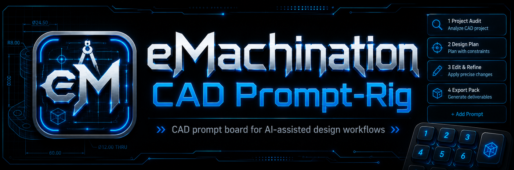

# eMachination CAD Prompt-Rig



eMachination CAD Prompt-Rig is a local-first CAD/patent prompt board for sketch cleanup, drawing review, dimension questions, and human-reviewed CAD rebuild workflows.

Human review is required. The board produces prompts, questions, checklists, and review aids; it does not establish legal, engineering, dimensional, manufacturing, or production conclusions.

It is a sibling product to the coding Prompt-Rig. The Windows AutoHotkey v2 runtime, launcher shape, editable Markdown prompt library, Prompt Forge, Prompt Coach, and no-images/stub-image package posture are preserved from the baseline.

## Repository Navigation

| Page | Link |
| --- | --- |
| Start here | [START_HERE.md](START_HERE.md) |
| Windows install | [docs/windows-install.md](docs/windows-install.md) |
| Linux install | [docs/linux-install.md](docs/linux-install.md) |
| Visual guide | [docs/visual-guide.md](docs/visual-guide.md) |
| User guide | [docs/USER_GUIDE.md](docs/USER_GUIDE.md) |
| Prompt catalog | [docs/PROMPT_CATALOG.md](docs/PROMPT_CATALOG.md) |
| CAD/Patent SRS | [docs/cad_patent_prompt_rig_srs_v0_1.md](docs/cad_patent_prompt_rig_srs_v0_1.md) |
| Roadmap | [docs/ROADMAP.md](docs/ROADMAP.md) |
| License | [LICENSE](LICENSE) |

## What This Is

- A hotkey-driven prompt board for CAD / mechanical / patent drawing workflow support.
- A set of editable Markdown prompts under `prompts/`.
- A prompt index at `prompts/index.ini`.
- Windows AutoHotkey v2 launchers for the primary runtime.
- A pragmatic Linux runtime/source path.
- Prompt Forge and Prompt Coach tools for reusable prompt work.

## What This Is Not

- It is not CAD software.
- It does not create native `.f3d`, `.ipt`, `.sldprt`, `.dwg`, `.dxf`, or `.step` files.
- It is not a patent attorney, agent, or legal opinion generator.
- It does not guarantee USPTO acceptance or legal compliance.

## Active Profiles

| Profile | Purpose |
| --- | --- |
| Rough-In Parts | Help take an early mechanical idea and rough it into a more coherent part concept for review. |
| Mechanical Drawing Cleanup | Turn rough drawings, AI mechanical concepts, or loose design sketches into clean mechanical drawing prompts and image-generation prompts. |
| CAD Application Assist | Convert a cleaned part concept into application-specific CAD instructions. |
| Patent Drawing Standards | Turn cleaned mechanical concepts into patent-style drawing instructions without claiming legal compliance. |
| Patent Flowcharts / System Diagrams | Create patent-style process diagrams, system diagrams, architecture diagrams, and method flowcharts. |
| Figure Packet / Release Review | Assemble drawings, CAD instructions, patent figures, flowcharts, and review notes into a complete drawing packet. |


Each profile has `primary`, `secondary`, and `tertiary` boards. Each board has eight prompt slots.

## Windows Quick Start

Windows is the primary/current best-supported runtime path.

1. Install AutoHotkey v2.
2. Extract this package into a stable folder.
3. Run:

   ```text
   launchers\Start eMachination CAD Patent Prompt-Rig.bat
   ```

4. Press:

   ```text
   ScrollLock
   ```

## Hotkeys

| Control | Action |
|---|---|
| ScrollLock | Open Primary board |
| Shift + ScrollLock | Open Tertiary board |
| Pause / Break | Cycle boards |
| Ctrl + Pause / Break | Cycle boards |
| NumLock | Cycle CAD / patent profiles while board is focused |
| Ctrl + ScrollLock | Close board |
| Ctrl + Alt + ScrollLock | Exit runtime |
| Esc | Close board while focused |
| F5 | Reload prompt index/files while focused |

## Image Assets

This package intentionally keeps the no-images posture. Brand and example image locations may contain `.txt` stubs so real images can be inserted later without changing runtime paths.

## Linux Status

Linux source/runtime files remain included. Linux support is pragmatic and documented, but Windows remains the primary release target for this product slice.

## License

This project is licensed under the GNU General Public License v3.0. See [LICENSE](LICENSE).
